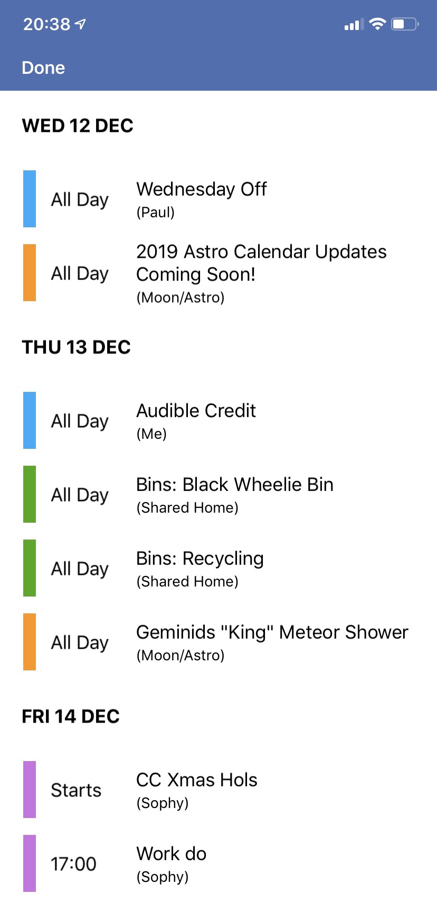

# Paul Sidnell's Scriptable Scripts

## Calendars.js

Presents a calendar picker and creates OmniFocus tasks from selected events.

Can be used stand alone on an iPhone or in split view (for example with the OmniFocus app) on an iPad.

Some configuration options exist in the script itself.

## Template.js

Expands variables into template projects shared from OmniFocus and sends them back as TaskPaper.
